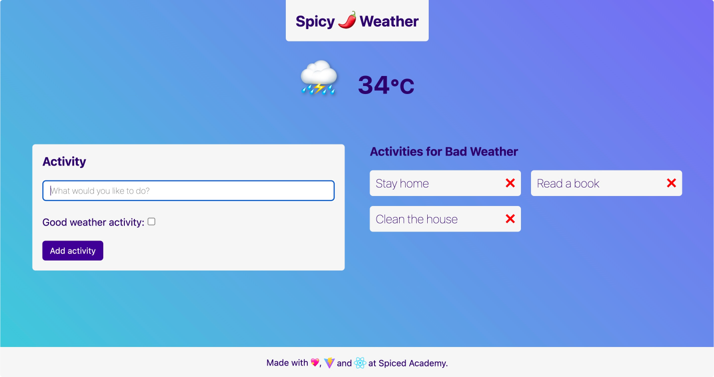
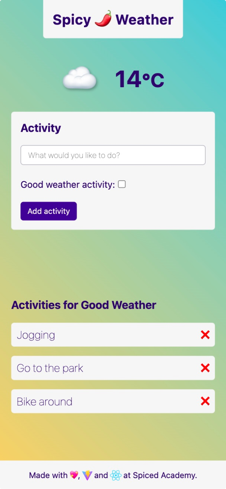

# spicy 🌶️ weather

Example app for Project 4 - Weather App

## Getting Started

1. Clone this repo
2. `cd` into the project folder
3. Run `npm install`
4. Run `npm run dev`
5. Open browser to `localhost:5173`
6. Enjoy!

## Built With

-   [React](https://reactjs.org/) - The web framework used
-   [Vite](https://vitejs.dev/) - The build tool used

### Desktop version

### Mobile version

